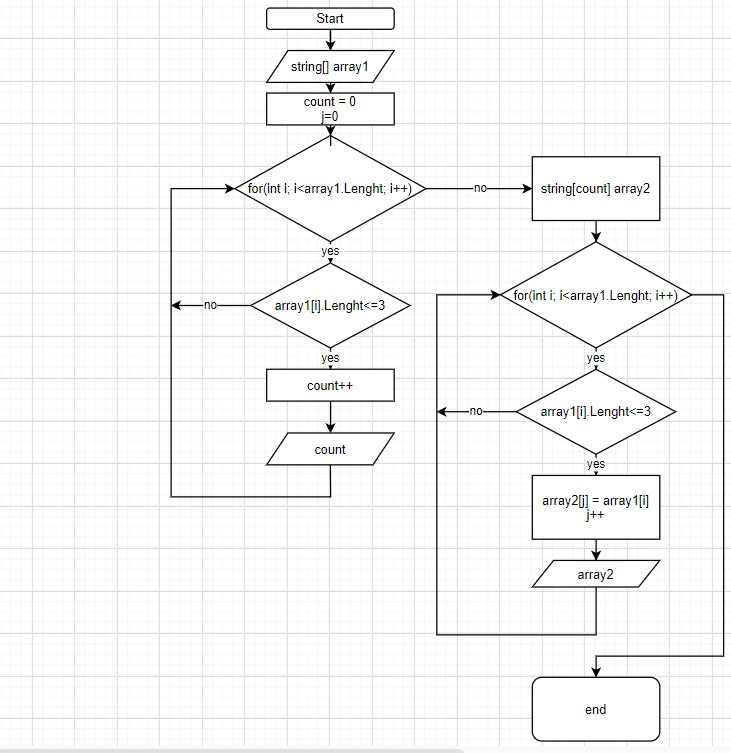

# Задача:

Написать программу, которая из имеющегося массива строк формирует новый массив из строк, длина которых меньше, либо равна 3 символам. Первоначальный массив можно ввести с клавиатуры, либо задать на старте выполнения алгоритма. При решении не рекомендуется пользоваться коллекциями, лучше обойтись исключительно массивами.

# Решение

1. Создали массив с элементами;

2. Пишем цикл, проходящий по длинне масcива;

3. В цикле пишем условие, чтоб длинна была меньше или равна 3;

4. Находим число элементов удовлетворяющие условию;

5. Создаем второй массив, с длинной равной числу элементов удовлетворяющим условию;

6. Пишем еще цикл, проходящий по массиву, в цикле пишем условие, чтоб длина была меньше или равна 3;

7. Если условие соблюдается, элемент массива записываем в массив;

8. Печатаем Write;

Присутствует алгоритм выполнения 